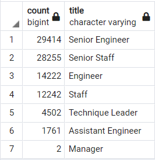

##Pewlett_Hackard_Analysis##

**Overview of the analysis:**

I am doing this analysis for the company “Pewlett_Hackard (PH)” , The company wants to plan and be ready for the baby boomers retirement "silver tsunami", I am trying to filter the baby boomers who will retire in the near future ,so that will enable the company to plan for hiring events for those positions, plan retirement packages and mentorship programs for the eligible emplooyes.

**Results:**

The company decided that anyone born between Jan 1,1952 and Dec 31,1955 will begin to retire soon and anyone born between 
January 1, 1965 and December 31, 1965 are eligible to enter the "Mentorship Program".

1. I have created a table that will filter the employees born between Jan 1,1952 and Dec 31,1955. Table name is "retirement_titles" this table has duplicate employee numbers as some employees changed position during their time in the company.

2.To get a list with out any duplicates I have used DISTINCT ON in a query and created another table called unique_titles, This table contains all employees born between Jan 1,1952 and Dec 31,1955 eligibe for retirement and some employees already left the company, the company need old employee information for retirement benfits purposes so kept this table.

3.I have created a table to show the count of emp_no to see which positions the company should plan to hire in near future.

4.I have created a table to identify which employees are eligible to work in the "Mentorship Program"

5. I have created 2 extra tables , one to show total employees currently working with us who are eligble for retirement as per company's criteria ,that table is called baby_boomer_list there are 33118 employees born between Jan 1,1952 and Dec 31,1955 and currently working with the company.

6. I have created a table to show the count of employees who will retire and their title

**Summary:**

All relevant CSV files and images are in resource folder , “Pewlett_Hackard (PH)” should start hiring based on the baby_boomer_count table as that has the current employee information who will be eligible for retirement in near future.

The company should start the "Mentorship Program" there are 1549 epmloyees eligible for the program. The company should decide on the budget and how many employees can actually join the programs and the requirement information.
